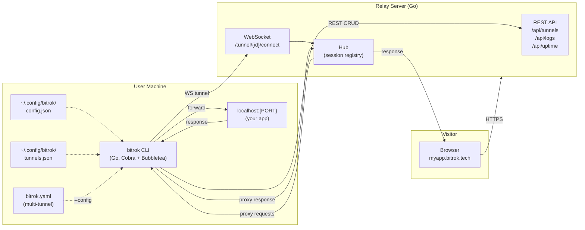
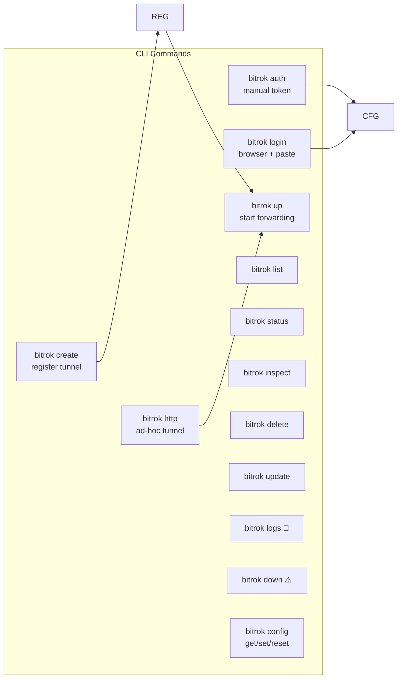

# Bitrok CLI Reference

## Architecture



```mermaid
sequenceDiagram
    participant C as CLI
    participant S as Relay Server
    participant L as localhost:PORT

    Note over C,S: 1. Authentication
    C->>S: POST /api/tunnels<br/>Authorization: Bearer {token}
    S-->>C: { id, name, host, port }

    Note over C,S: 2. Tunnel Session (WebSocket)
    C->>S: GET /tunnel/{id}/connect (upgrade)
    C->>S: WS: { type: "hello", token, tunnel_id }
    S-->>C: WS: { type: "ping" }
    C-->>S: WS: { type: "pong" }

    Note over C,S,L: 3. Request Relay
    S->>C: WS: { type: "req", req_id, method, path,<br/>        headers, body_b64 }
    C->>L: HTTP {method} {path}
    L-->>C: HTTP response
    C->>S: WS: { type: "res", req_id, status,<br/>        headers, body_b64 }
```



## Commands

### `bitrok auth`
Manual authentication. Saves server URL + token to config.json.

| Flag | Alias | Default | Description |
|------|-------|---------|-------------|
| `--server` | `-s` | — | Server URL (required) |
| `--token` | `-t` | — | Auth token (or `BITROK_TOKEN` env var) |

**Status**: ✅ Working

### `bitrok login`
Browser-based auth. Opens the web dashboard CLI token page, prompts to paste the generated token.

| Flag | Alias | Default | Description |
|------|-------|---------|-------------|
| `--server` | `-s` | — | Server URL (or `BITROK_SERVER` env var) |

**Status**: ✅ Working

### `bitrok create`
Register a new tunnel on the server. Saves locally to tunnels.json.

| Flag | Alias | Default | Description |
|------|-------|---------|-------------|
| `--name` | `-n` | — | Tunnel name (required) |
| `--host` | `-H` | — | Proxy host e.g. `api.bitrok.tech` (required) |
| `--port` | `-p` | — | Local port to forward (required) |

**Status**: ✅ Working

### `bitrok up [name]`
Start forwarding traffic for a registered tunnel. Opens a Bubbletea TUI dashboard showing live request logs.

| Flag | Alias | Default | Description |
|------|-------|---------|-------------|
| `--config` | `-c` | — | Path to `bitrok.yaml` (multi-tunnel headless mode) |
| `--host` | `-H` | — | Ad-hoc host (requires server-side registration first) |
| `--port` | `-p` | — | Ad-hoc port |

**Status**: ✅ Working

### `bitrok http <port>`
Ad-hoc tunnel. Creates a temp tunnel on the server with auto-assigned (or custom) subdomain, starts forwarding, auto-deletes on exit.

| Flag | Alias | Default | Description |
|------|-------|---------|-------------|
| `--subdomain` | `-s` | — | Subdomain e.g. `api` → `api.bitrok.tech` |
| `--host` | `-H` | — | Full host (overrides --subdomain) |

**Status**: ✅ Working

### `bitrok list`
List all registered tunnels from the server.

| Flag | Alias | Default | Description |
|------|-------|---------|-------------|
| `--json` | `-j` | false | Output as raw JSON |

**Status**: ✅ Working

### `bitrok status`
Quick summary of active tunnel count (`X/Y`).

**Status**: ✅ Working

### `bitrok inspect [name]`
Detailed info for a single tunnel (host, port, active status, created/updated timestamps).

| Flag | Alias | Default | Description |
|------|-------|---------|-------------|
| `--host` | `-H` | — | Inspect by host instead of name |
| `--json` | `-j` | false | Output as raw JSON |

**Status**: ✅ Working

### `bitrok delete [name]`
Delete a tunnel from the server and local registry. Prompts for confirmation.

| Flag | Alias | Default | Description |
|------|-------|---------|-------------|
| `--host` | `-H` | — | Delete by host instead of name |

**Status**: ✅ Working

### `bitrok update [name]`
Update a tunnel's hostname and/or port on server and local cache.

| Flag | Alias | Default | Description |
|------|-------|---------|-------------|
| `--host` | `-H` | — | New host |
| `--port` | `-p` | 0 | New port |

**Status**: ✅ Working

### `bitrok logs [name]`
Show request logs. Currently prints a "not implemented" message and suggests using the TUI dashboard.

| Flag | Alias | Default | Description |
|------|-------|---------|-------------|
| `--tail` | `-t` | 50 | Number of lines to show |
| `--all` | `-a` | false | Show logs for all tunnels |

**Status**: 🚧 Not implemented (stub only — no SSE log streaming)

### `bitrok down [name]`
Show stop instructions for a tunnel. Cannot remotely stop a session — tunnels stop when the CLI session exits (Ctrl+C/q).

| Flag | Alias | Default | Description |
|------|-------|---------|-------------|
| `--all` | `-a` | false | Check all tunnels |

**Status**: ⚠️ Limited (info-only, no remote stop)

### `bitrok config`
Manage CLI configuration (subcommand: `get`, `set`, `reset`).

**Subcommands:**

| Command | Args | Description |
|---------|------|-------------|
| `config get` | — | Show config (token masked for safety) |
| `config get --json` | — | Show config as raw JSON |
| `config set` | `<key> <value>` | Set `server_url`, `token`, or `default_domain` |
| `config reset` | — | Reset config to defaults (prompts confirm) |

**Status**: ✅ Working

---

## Authentication

Two methods, both save to `~/.config/bitrok/config.json`:

### 1. `bitrok auth --server <url> --token <token>`
Flags or `BITROK_TOKEN` env var. Recommended for headless/automated setups (`BITROK_TOKEN` avoids shell history).

```bash
export BITROK_TOKEN="eyJ..."
bitrok auth --server https://bitrok.tech
```

### 2. `bitrok login`
Opens browser to `<server>/dashboard/cli-token` — sign in via web, generate a CLI token, paste back into terminal. Works in SSH/headless (shows URL fallback).

Token format: JWT, shared secret between web dashboard and relay server (`BITROK_JWT_SECRET`). All requests carry `Authorization: Bearer {token}`.

**Env vars:**
| Var | Used by |
|-----|---------|
| `BITROK_SERVER` | `login` — overrides saved server URL |
| `BITROK_TOKEN` | `auth` — token via env instead of flag |

---

## How the CLI Talks to the Server

### 1. REST API (CRUD operations)

| Method | Path | Description |
|--------|------|-------------|
| `POST` | `/api/tunnels` | Create tunnel |
| `GET` | `/api/tunnels` | List tunnels |
| `GET` | `/api/tunnels/{id}` | Get tunnel by ID |
| `PATCH` | `/api/tunnels/{id}` | Update tunnel |
| `DELETE` | `/api/tunnels/{id}` | Delete tunnel |
| `GET` | `/api/logs` | Get request logs |
| `GET` | `/api/uptime` | Get uptime stats |
| `GET` | `/health` | Server health |

All REST calls use `Authorization: Bearer {token}`. CLI config holds `server_url` and `token`.

### 2. WebSocket Tunnel Session

Path: `wss://{server}/tunnel/{id}/connect` (upgraded from HTTPS with `Authorization: Bearer {token}` header).

Protocol frames (all JSON over the WS):

| Frame | Direction | Fields | Description |
|-------|-----------|--------|-------------|
| `hello` | CLI → Server | `type`, `token`, `tunnel_id` | Initial handshake after WS upgrade |
| `ping` | Server → CLI | `type` | Server-side keepalive (every ~60s) |
| `pong` | CLI → Server | `type` | Keepalive reply |
| `req` | Server → CLI | `type`, `req_id`, `method`, `path`, `host`, `headers`, `body_b64` | Proxy an HTTP request |
| `res` | CLI → Server | `type`, `req_id`, `status`, `headers`, `body_b64` | Proxy the HTTP response back |

**Relay flow:**
1. Visitor hits `https://myapp.bitrok.tech/`
2. Server matches host → finds active WS session in Hub
3. Server sends `ProxyRequest` frame (body base64-encoded) over WS
4. CLI decodes, forwards HTTP to `localhost:{port}`
5. CLI reads response, encodes body as base64, sends `ProxyResponse` frame
6. Server writes response to visitor (buffered respChan per reqID, 30s timeout)

**Hop-by-hop headers stripped** on both directions: `Connection`, `Keep-Alive`, `Proxy-Authenticate`, `Proxy-Authorization`, `TE`, `Trailer`, `Transfer-Encoding`, `Upgrade`.

**Concurrency**: Max 50 concurrent request handlers per tunnel (semaphore). Excess returns HTTP 503.

**Reconnection**: Exponential backoff (1s → 2s → 4s → ... → 30s max), max 5 retries.

---

## Configuration Files

### `~/.config/bitrok/config.json`
```json
{
  "server_url": "https://bitrok.tech",
  "token": "eyJ...",
  "default_domain": "bitrok.tech"
}
```
Permissions: `0600`. Created/managed by `bitrok auth`, `bitrok login`, `bitrok config`.

### `~/.config/bitrok/tunnels.json`
```json
{
  "tunnels": [
    {
      "id": "uuid",
      "name": "myapp",
      "host": "myapp.bitrok.tech",
      "port": 3000,
      "created_at": "2026-07-18T..."
    }
  ]
}
```
Local cache of created tunnels. Managed by `create`, `delete`, `update` commands. Looked up by `up`, `down`, `inspect`.

### `bitrok.yaml` (multi-tunnel)
```yaml
server: https://bitrok.tech
token: eyJ...
tunnels:
  myapp:
    host: myapp.bitrok.tech
    port: 3000
  api:
    host: api.bitrok.tech
    port: 8080
```
Loaded via `bitrok up --config bitrok.yaml`. Runs all tunnels in headless (no TUI) mode concurrently. Each tunnel must already exist in the server registry (created via `bitrok create` or web dashboard).

---

## UI / Output Kit

All commands route through `cli/internal/ui/output.go` for consistent formatting:

| Component | Usage |
|-----------|-------|
| `ui.Success(msg)` | Green checkmark |
| `ui.Warn(msg)` | Amber warning |
| `ui.ErrorOut(msg)` | Red error |
| `ui.Info(msg)` | Gray info |
| `ui.Hint(msg)` | Dim hint |
| `ui.Section(title, body)` | Section header |
| `ui.KV(label, value)` | Key-value line |
| `ui.DetailCard(title, rows)` | Labeled detail card |
| `ui.Confirm(msg)` | Yes/no prompt |
| `ui.RenderTable(tunnels)` | Gradient-header tunnel list |
| `ui.PrintBanner(version)` | ASCII art logo |
| `ui.BootSequence(steps)` | Animated startup steps |

Color palette (no cyan — amber theme):
- Amber `#fbbf24`, AmberLight `#fcd34d`, AmberDim
- Bg `#0a0a0a`, BgCard, White `#ededed`
- Gray `#737373`, DarkGray
- Green `#22c55e`, Red `#ef4444`

---

## Build

```bash
cd cli && go build -o bitrok ./cmd/bitrok
```

Single binary. Entrypoint: `cli/cmd/bitrok/main.go` → `cli/internal/cli/root.go` (Cobra).

## Implementation Status

| Command | Status | Notes |
|---------|--------|-------|
| `auth` | ✅ | Manual token via flag or env var |
| `login` | ✅ | Browser + paste workflow |
| `create` | ✅ | Registers tunnel on server + caches locally |
| `up` | ✅ | Single-tunnel TUI mode, multi-tunnel headless via `--config` |
| `http` | ✅ | Ad-hoc tunnel with auto-cleanup |
| `list` | ✅ | Table output or JSON |
| `status` | ✅ | Active tunnel count |
| `inspect` | ✅ | Detail card or JSON |
| `delete` | ✅ | With confirmation prompt |
| `update` | ✅ | Host and/or port |
| `config` | ✅ | get/set/reset |
| `logs` | 🚧 | Stub only — no SSE streaming |
| `down` | ⚠️ | Info-only (tunnels stop on CLI exit) |
| `inspect --traffic` | ❌ | Not implemented |
| Live log streaming (SSE) | ❌ | Not implemented |
